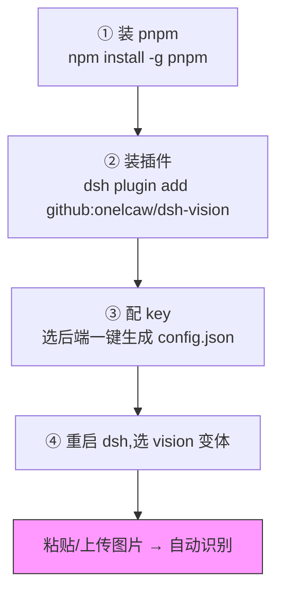
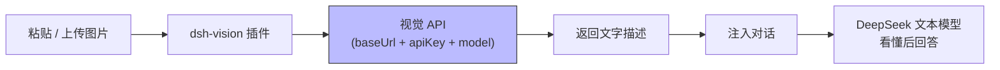

# dsh-vision

给 DeepSeek Harness(dsh)用的图片识别桥接插件。DeepSeek 文本模型本身收不了图,这个插件把图片转成文字,让文本模型也能"看懂"图片内容。

## 快速上手(4 步)



1. **装 pnpm**(一次性):`npm install -g pnpm`
2. **装插件**:
   ```sh
   npx -y @deepseek-ai/dsh plugin --profile web add github:onelcaw/dsh-vision
   ```
3. **配 key**:往下翻到「一键配置」,选一个后端,整段复制到终端执行(把 key 换成你自己的)
4. **重启 dsh**,在模型选择器里选 `DeepSeek (vision)`,然后粘贴/上传图片即可自动识别

## 它做了什么

1. **`vision_read_image` 工具** —— 传入本地文件路径或 http(s) URL,返回图片内容的文字转写。
2. **`(vision)` 模型变体** —— 把 DeepSeek 文本模型克隆成声明了图片输入的 `(vision)` 变体;选它之后,粘贴/上传的图片会在发请求前被自动转成文字证据,再交给真正的文本模型。

## 工作原理(视觉引擎)

调用任意 **OpenAI 兼容的 `/chat/completions` 视觉接口**,把图片以 `image_url`(base64 或 URL)形式发给视觉模型,拿到文字描述后注入对话。



## 配置

配置文件:`~/.dsh-vision/config.json`(首次启动会自动生成,权限 0600)。改完保存后**无需重启 dsh**,下次读图即生效(每次读图都会重新读取)。

```json
{
  "baseUrl": "https://api.openai.com/v1",
  "apiKey": "",
  "model": "",
  "prompt": "Transcribe this image in full detail. Reproduce all visible text (OCR) verbatim, ...",
  "maxTokens": 2048,
  "timeoutMs": 120000,
  "maxImageBytes": 25165824
}
```

### 每个字段的含义

| 字段 | 必填 | 说明 |
| :-- | :--: | :-- |
| `baseUrl` | ✅ | 视觉 API 的根地址(**不含** `/chat/completions`)。按后端填,见下表。 |
| `apiKey` | ✅ | 该后端的 API 密钥。Ollama 本地模型可随便填一个占位(如 `ollama`)。 |
| `model` | ✅ | 视觉模型名,**必须支持图片输入**。按后端填,见下表。 |
| `prompt` | ❌ | 发给视觉模型的转写指令。默认已要求逐字 OCR + 详细描述,一般不用改。 |
| `maxTokens` | ❌ | 视觉模型返回文字的最大 token 数,默认 2048;图很密/文字很多时可调大。 |
| `timeoutMs` | ❌ | 单次读图超时(毫秒),默认 120000(2 分钟)。 |
| `maxImageBytes` | ❌ | 单张图片大小上限(字节),默认 25165824(即 25 × 1024 × 1024 = 25 MB)。 |

### 一键配置(选一个,整段复制到终端执行)

> 下面每条命令都会**直接生成** `~/.dsh-vision/config.json`(只写必填的 3 个字段,其余用默认值)。把 `"把key粘贴到这里"` 换成你自己的 key 即可。

#### Gemini(免费,推荐)

```sh
mkdir -p ~/.dsh-vision && cat > ~/.dsh-vision/config.json <<'EOF'
{
  "baseUrl": "https://generativelanguage.googleapis.com/v1beta/openai",
  "apiKey": "把key粘贴到这里",
  "model": "gemini-2.0-flash"
}
EOF
chmod 600 ~/.dsh-vision/config.json
```
key 获取:[aistudio.google.com](https://aistudio.google.com) → Get API key(免费、无需绑卡)

#### OpenAI

```sh
mkdir -p ~/.dsh-vision && cat > ~/.dsh-vision/config.json <<'EOF'
{
  "baseUrl": "https://api.openai.com/v1",
  "apiKey": "把key粘贴到这里",
  "model": "gpt-4o-mini"
}
EOF
chmod 600 ~/.dsh-vision/config.json
```
key 获取:[platform.openai.com/api-keys](https://platform.openai.com/api-keys)

#### Qwen-VL(通义千问)

```sh
mkdir -p ~/.dsh-vision && cat > ~/.dsh-vision/config.json <<'EOF'
{
  "baseUrl": "https://dashscope.aliyuncs.com/compatible-mode/v1",
  "apiKey": "把key粘贴到这里",
  "model": "qwen-vl-plus"
}
EOF
chmod 600 ~/.dsh-vision/config.json
```
key 获取:[bailian.console.aliyun.com](https://bailian.console.aliyun.com) → API-KEY

#### GLM-4V(智谱)

```sh
mkdir -p ~/.dsh-vision && cat > ~/.dsh-vision/config.json <<'EOF'
{
  "baseUrl": "https://open.bigmodel.cn/api/paas/v4",
  "apiKey": "把key粘贴到这里",
  "model": "glm-4v"
}
EOF
chmod 600 ~/.dsh-vision/config.json
```
key 获取:[open.bigmodel.cn](https://open.bigmodel.cn) → API Keys

#### Moonshot(Kimi)

```sh
mkdir -p ~/.dsh-vision && cat > ~/.dsh-vision/config.json <<'EOF'
{
  "baseUrl": "https://api.moonshot.cn/v1",
  "apiKey": "把key粘贴到这里",
  "model": "moonshot-v1-8k-vision-preview"
}
EOF
chmod 600 ~/.dsh-vision/config.json
```
key 获取:[platform.moonshot.cn](https://platform.moonshot.cn) → API Key

#### Ollama 本地(免费、离线、无需 key)

```sh
mkdir -p ~/.dsh-vision && cat > ~/.dsh-vision/config.json <<'EOF'
{
  "baseUrl": "http://localhost:11434/v1",
  "apiKey": "ollama",
  "model": "llava"
}
EOF
chmod 600 ~/.dsh-vision/config.json
```
前提:先装 [ollama.com](https://ollama.com),并 `ollama pull llava`(也可用 `qwen2.5vl` 等视觉模型,`model` 换成对应名即可)。

#### DeepSeek-VL / 其它自建(OpenAI 兼容)

```sh
mkdir -p ~/.dsh-vision && cat > ~/.dsh-vision/config.json <<'EOF'
{
  "baseUrl": "你的服务地址(不含 /chat/completions)",
  "apiKey": "你的服务key",
  "model": "你的模型名"
}
EOF
chmod 600 ~/.dsh-vision/config.json
```

## 安装

**前提**:需要 `pnpm`(dsh 的插件管理器依赖它)。没有就先装一次:

```sh
npm install -g pnpm
# 或:corepack enable pnpm
```

然后一条命令安装(直接从 GitHub,无需先 clone):

```sh
npx -y @deepseek-ai/dsh plugin --profile web add github:onelcaw/dsh-vision
```

安装后**重启 dsh**。

### 本地开发安装(改代码用)

```sh
git clone https://github.com/onelcaw/dsh-vision
npx -y @deepseek-ai/dsh plugin --profile web add file:"$(pwd)/dsh-vision"
```

## 使用

- **粘贴/上传图片**:在模型选择器里选中 `DeepSeek (vision)`(或带 `(vision)` 后缀的模型),然后正常粘贴/上传图片并提问,内容会被自动识别。
- **读本地文件/URL**:直接让我调用 `vision_read_image` 工具,传入文件路径或图片 URL。
- 若未选 `(vision)` 变体,纯文本模型会拒绝图片(这是 dsh 的准入规则);这种情况下改走 `vision_read_image` 工具 + 文件路径即可。

## 卸载

```sh
npx -y @deepseek-ai/dsh plugin --profile web remove dsh-vision
```

配置残留可自行删除 `~/.dsh-vision/`。
